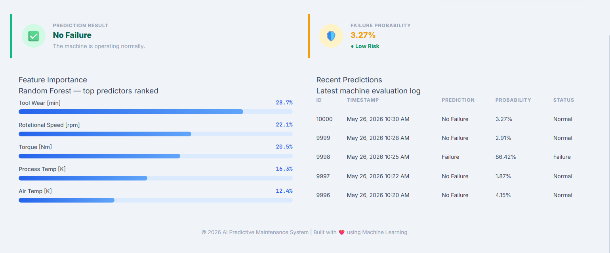

# 🔧 AI-Based Predictive Maintenance Failure Detection System

An end-to-end Machine Learning application that predicts industrial machine failures before they occur using sensor data. The project includes data ingestion, preprocessing, model training, prediction pipeline, and a Flask web application for real-time failure prediction.

🌐 **Live Demo:** https://ai-based-predictive-maintenance-failure.onrender.com/

---

## 🚀 Features

- Predict machine failure using real-time sensor inputs.
- End-to-end Machine Learning pipeline.
- Interactive Flask web dashboard.
- Automatic data preprocessing before prediction.
- Model persistence using Pickle.
- Clean project architecture for production-ready ML applications.

---

## 📸 Application Preview




---

## 🧠 Machine Learning Workflow

```
Raw Data
      │
      ▼
Data Ingestion
      │
      ▼
Data Validation
      │
      ▼
Data Transformation
      │
      ▼
Feature Engineering
      │
      ▼
Model Training
      │
      ▼
Model Evaluation
      │
      ▼
Best Model Selection
      │
      ▼
Prediction Pipeline
      │
      ▼
Flask Web Application
```

---

## 📊 Model Evaluation

Multiple Machine Learning algorithms were trained and compared.

Models evaluated:

- Logistic Regression
- Decision Tree Classifier
- Random Forest Classifier
- XGBoost Classifier
- Support Vector Machine
- Gaussian Naive Bayes

### Evaluation Metrics

The primary evaluation metric used for model selection was:

- **Average Precision Score (Precision-Recall AUC)**

Since machine failure prediction is an **imbalanced classification problem**, Average Precision Score provides a more reliable evaluation than accuracy by emphasizing correct identification of failure cases while minimizing false alarms.

After evaluation, **XGBoost** achieved the best overall performance and was selected for deployment.

---

## 🛠 Tech Stack

### Programming

- Python

### Machine Learning

- Scikit-Learn
- XGBoost
- NumPy
- Pandas

### Data Visualization

- Matplotlib

### Backend

- Flask

### Frontend

- HTML
- CSS

### Development Tools

- Git
- GitHub
- VS Code
- WSL2 (Ubuntu)

### Deployment

- Render

---

## 📂 Project Structure

```
AI-Based-Predictive-Maintenance/
│
├── artifacts/
├── notebooks/
├── src/
│   ├── components/
│   ├── pipeline/
│   ├── logger.py
│   ├── exception.py
│   └── utils.py
│
├── templates/
├── static/
├── application.py
├── requirements.txt
├── setup.py
└── README.md
```

---

## ⚙ Installation

Clone the repository

```bash
git clone https://github.com/Suryansh9369/AI-Based-Predictive-Maintenance-Failure-Detection-System.git
```

Move into the project

```bash
cd AI-Based-Predictive-Maintenance-Failure-Detection-System
```

Create virtual environment

```bash
python -m venv venv
```

Activate environment

Linux

```bash
source venv/bin/activate
```

Windows

```bash
venv\Scripts\activate
```

Install dependencies

```bash
pip install -r requirements.txt
```

Run the application

```bash
python application.py
```

---

## 🌐 Live Deployment

The application is deployed on **Render**.

https://ai-based-predictive-maintenance-failure.onrender.com/

---

## 📌 Current Version

**Version:** `0.1.0`

Current release includes:

- End-to-end ML pipeline
- Flask prediction dashboard
- Model deployment on Render

---

## 🔮 Future Improvements

- Deploy on AWS Elastic Beanstalk
- CI/CD using AWS CodePipeline
- Automatic model retraining
- Database integration
- User authentication
- Prediction history dashboard
- Monitoring and logging
- Docker containerization

---

## 👨‍💻 Author

**Suryansh Vishwakarma**

GitHub:
https://github.com/Suryansh9369

Portfolio:
https://suryanshvishwakarmaportfolio.netlify.app/

LinkedIn:
(Add your LinkedIn URL)

---