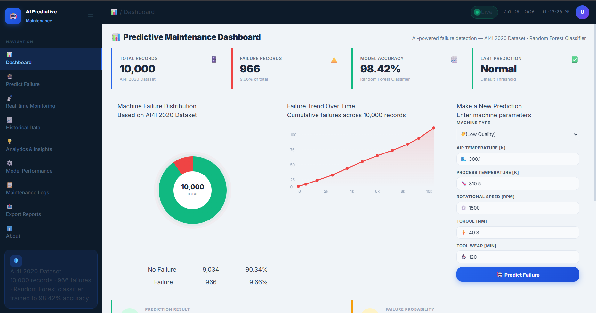
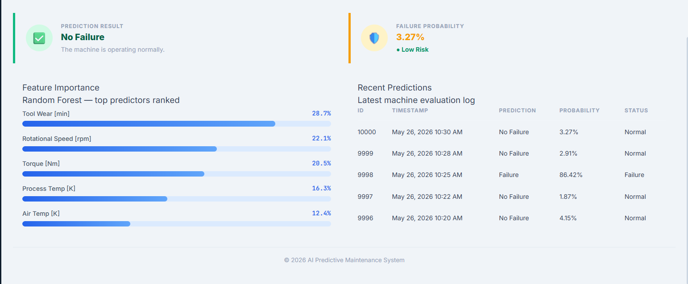
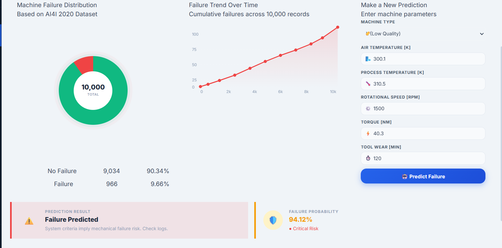
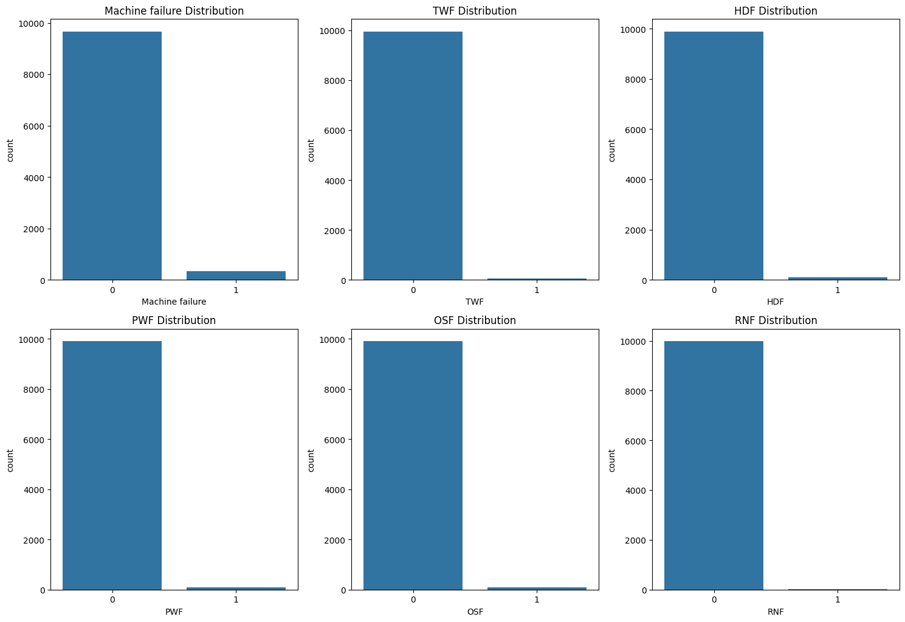
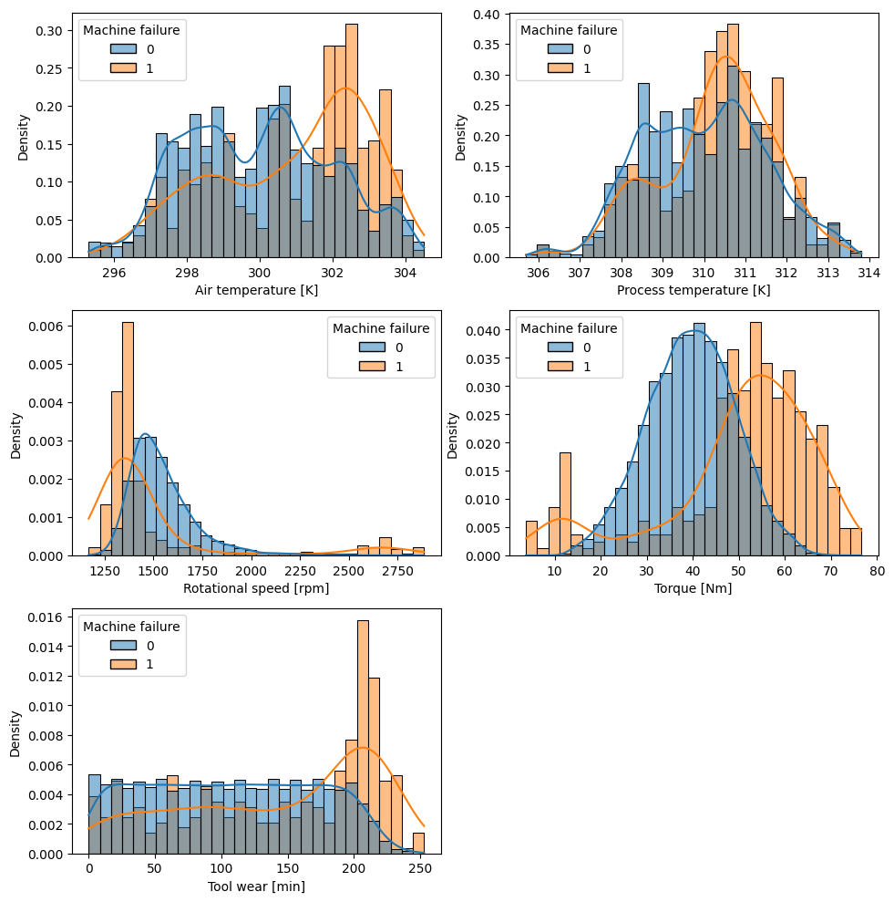
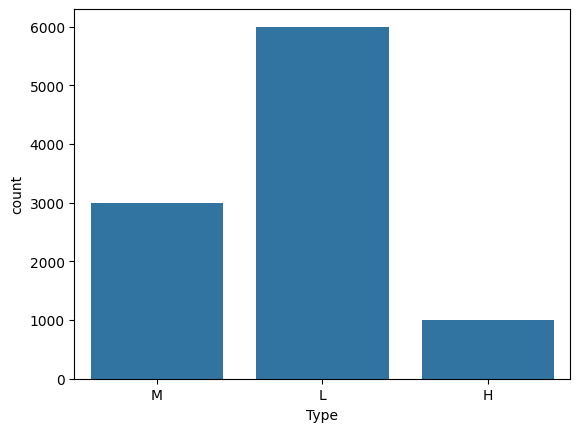
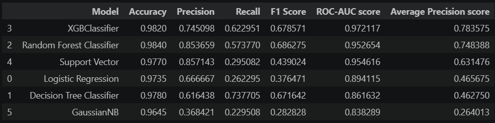
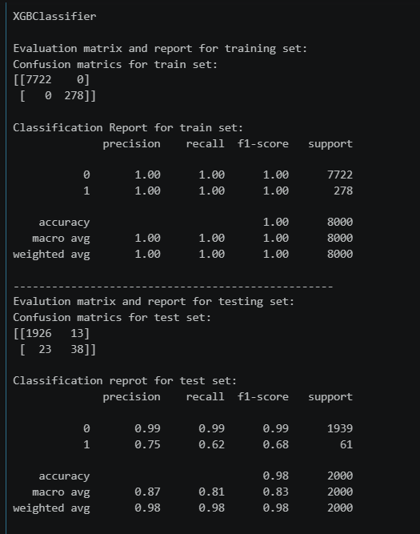

# 🔧 AI-Based Predictive Maintenance Failure Detection System


An end-to-end Machine Learning application that predicts industrial machine failures before they occur using sensor data. The project includes data ingestion, preprocessing, model training, prediction pipeline, and a Flask web application for real-time failure prediction.

## 🌐 Live Demo

**Web Application**

https://ai-based-predictive-maintenance-failure.onrender.com/

---
## 📖 Overview

AI-Based Predictive Maintenance Failure Detection System is an end-to-end Machine Learning application that predicts industrial machine failures using real-time sensor data.

The application enables proactive maintenance by identifying potential failures before they occur, helping reduce unexpected downtime, maintenance costs, and equipment damage.

The project covers the complete Machine Learning lifecycle including data ingestion, preprocessing, model training, model evaluation, prediction pipeline, and deployment through a Flask web application.

---

## ✨ Features

- End-to-end Machine Learning Pipeline
- Predict Machine Failure from Sensor Data
- Interactive Flask Dashboard
- Automatic Data Preprocessing
- Model Serialization using Pickle
- Real-time Prediction
- Responsive Web Interface
- Live Deployment on Render

---

## 📸 Application Preview

<p align="center">

</p>

<p align="center">

</p>

<p align="center">

</p>

---

## 🧠 Machine Learning Workflow

```
Raw Data
      │
      ▼
Data Ingestion
      │
      ▼
Data Validation
      │
      ▼
Data Transformation
      │
      ▼
Feature Engineering
      │
      ▼
Model Training
      │
      ▼
Model Evaluation
      │
      ▼
Best Model Selection
      │
      ▼
Prediction Pipeline
      │
      ▼
Flask Web Application
```

---

## 📊 Model Evaluation

Multiple Machine Learning algorithms were trained and compared.

Models evaluated:

- Logistic Regression
- Decision Tree Classifier
- Random Forest Classifier
- XGBoost Classifier
- Support Vector Machine
- Gaussian Naive Bayes

### Evaluation Metrics

The primary evaluation metric used for model selection was:

- **Average Precision Score (Precision-Recall AUC)**

Since machine failure prediction is an **imbalanced classification problem**, Average Precision Score provides a more reliable evaluation than accuracy by emphasizing correct identification of failure cases while minimizing false alarms.

After evaluation, **XGBoost** achieved the best overall performance and was selected for deployment.

---

## 🛠 Tech Stack

### Programming

- Python

### Machine Learning

- Scikit-Learn
- XGBoost
- NumPy
- Pandas

### Data Visualization

- Matplotlib

### Backend

- Flask

### Frontend

- HTML
- CSS

### Development Tools

- Git
- GitHub
- VS Code
- WSL2 (Ubuntu)

### Deployment

- Render

---

## 📂 Project Structure

```
AI-Based-Predictive-Maintenance/
│
├── artifacts/
├── notebooks/
├── src/
│   ├── components/
│   ├── pipeline/
│   ├── logger.py
│   ├── exception.py
│   └── utils.py
│
├── images/
├── templates/
├── static/
├── application.py
├── requirements.txt
├── setup.py
└── README.md
```

---
## 📊 Dataset

Dataset: **AI4I 2020 Predictive Maintenance Dataset**

**Features**

- Machine Type
- Air Temperature
- Process Temperature
- Rotational Speed
- Torque
- Tool Wear

**Target**

- Machine Failure (0 = No Failure, 1 = Failure)

---
# 📈 Exploratory Data Analysis

## Target Distribution

The dataset is highly imbalanced, making evaluation metrics such as Average Precision Score more suitable than relying solely on accuracy.

<p align="center">

</p>

---

## Sensor Distribution by Machine Failure

Sensor variables show distinct patterns between normal and failed machines.

<p align="center">

</p>

---
## Sensor Distribution by Machine Type

The distribution of sensor measurements differs across Low (L), Medium (M), and High (H) quality machines.

<p align="center">

</p>

---
# 🤖 Model Evaluation

Six Machine Learning algorithms were trained and compared.

- Logistic Regression
- Decision Tree
- Random Forest
- Support Vector Machine
- Gaussian Naive Bayes
- XGBoost

The models were evaluated using:

- Accuracy
- Precision
- Recall
- F1 Score
- ROC-AUC Score
- **Average Precision Score**

Average Precision Score was selected as the primary metric because predictive maintenance is an imbalanced classification problem where correctly identifying machine failures is more important than maximizing overall accuracy.

<p align="center">

</p>

---
# 🏆 Best Model

After evaluating all models, **XGBoost** achieved the best overall performance.

### Performance

- Accuracy : **98.20%**
- Precision : **74.51%**
- Recall : **62.30%**
- F1 Score : **67.86%**
- ROC-AUC : **97.21%**
- Average Precision : **78.36%**

<p align="center">

</p>

---
## ⚙ Installation

Clone the repository

```bash
git clone https://github.com/Suryansh9369/AI-Based-Predictive-Maintenance-Failure-Detection-System.git
```

Move into the project

```bash
cd AI-Based-Predictive-Maintenance-Failure-Detection-System
```

Create virtual environment

```bash
python -m venv venv
```

Activate environment

Linux

```bash
source venv/bin/activate
```

Windows

```bash
venv\Scripts\activate
```

Install dependencies

```bash
pip install -r requirements.txt
```

Run the application

```bash
python application.py
```

---
# 📦 Current Version

## v0.1.0

### Included

- End-to-end ML Pipeline
- Flask Prediction Dashboard
- Model Evaluation
- Render Deployment

---

## 📌 Current Version

**Version:** `0.1.0`

Current release includes:

- End-to-end ML pipeline
- Flask prediction dashboard
- Model deployment on Render

---

## 🔮 Future Improvements

- Deploy on AWS Elastic Beanstalk
- CI/CD using AWS CodePipeline
- Automatic model retraining
- Database integration
- User authentication
- Prediction history dashboard
- Monitoring and logging
- Docker containerization

---

## 👨‍💻 Author

**Suryansh Vishwakarma**

GitHub:
https://github.com/Suryansh9369

Portfolio:
https://suryanshvishwakarmaportfolio.netlify.app/

LinkedIn:
www.linkedin.com/in/suryansh-vishwakarma/

---